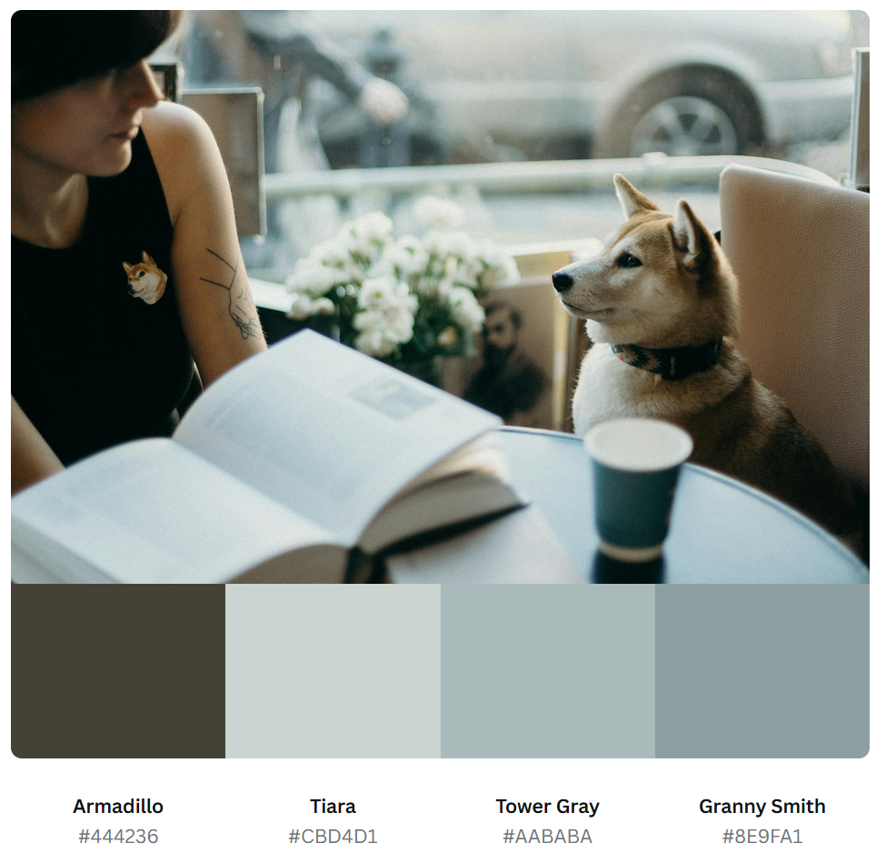
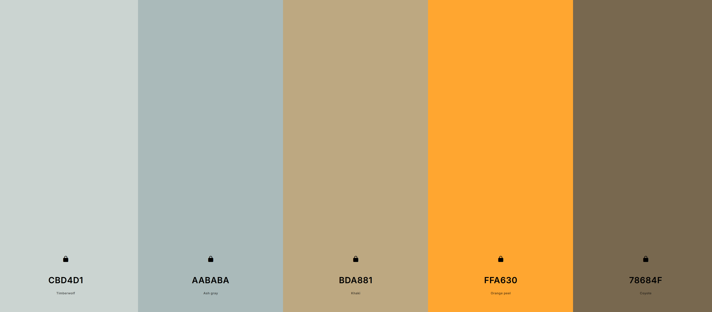
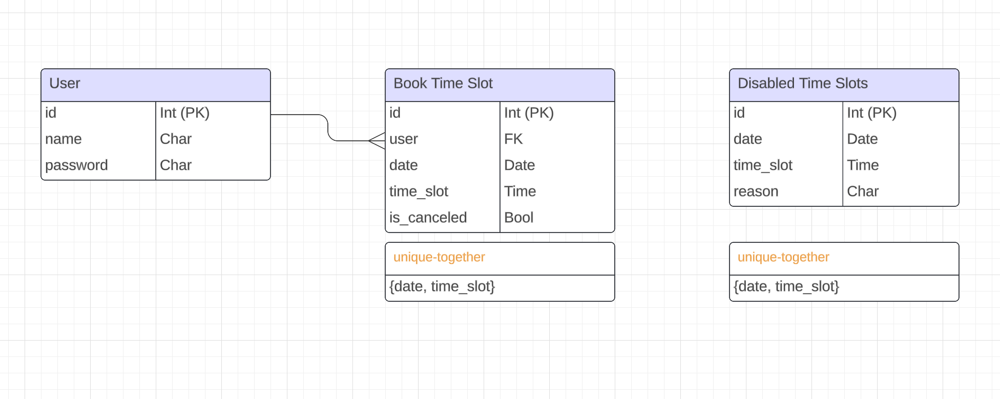

## Table Of Contents:
1. [Design & Planning](#design)
    * [User Stories](#user-stories)
    * [Wireframes](#wireframes)
    * [Agile Methodology](#agile-methodology)
    * [Colour Scheme](#colour-scheme)
    * [Database Diagram](#database-diagram)
    
2. [Features](#features)
3. [Technologies Used](#technologies-used)
4. [Libraries](#libraries-used)
5. [Testing](#testing)
6. [Bugs](#bugs)
7. [Deployment](#deployment)
8. [Credits](#credits)

## Design

Bark & Brew was designed with dog lovers and coffee enjoyers offering a welcoming booking webpage.
The design remains clean and minimal, ensuring that users can easily focus on the content and navigate the site without distractions.

### Colour Scheme
**Colors:** Originally I used a site to get colors from the main background picture.  

I then used coolors and just brightened up the colors and generated an orange to use as a stand out color.  

**Fonts:** I chose the Montserrat and Roboto fonts because they were simple and clean looking to not distract the user away from the content on the site.

**Images:** Most Images were taken from [Pexels.com](https://www.pexels.com/)
            Thank you, Jemma, Teddy, Tyson and Botila for staring as the waiters & waitresses

### Agile Methodology
I used the Projects tool within GitHub to manage the different processes needed for this project to be completed. At the beginning, a Project titled "Bark & Brew Project Board" was created on GitHub and linked to the Bark & Brew repository. I did change the name of the repository as originally it was titled django-project. The project board can be found [here]()

### User Stories

[#1 User Story: Users Can Create an Account](https://github.com/MEdw4rds/django-blog/issues/13)
[#2 User Story: Users Can book a timeslot to visit](https://github.com/MEdw4rds/django-blog/issues/11)
[#3 User Story: Users Can manage their bookings ](https://github.com/MEdw4rds/django-blog/issues/20)
[#4 User Story: Users can't book a timeslot for a past date](https://github.com/MEdw4rds/Bark-and-Brew/issues/1)
[#5 User Story: Admin can manage and disable timeslots if required](https://github.com/MEdw4rds/django-blog/issues/12)
[#6 User Story: Welcoming and easy to navigate homepage](https://github.com/MEdw4rds/Bark-and-Brew/issues/2)
[#7 User Story: A simple booking form for users to fill out](https://github.com/MEdw4rds/Bark-and-Brew/issues/3)

### Wireframes
Attach wireframes in this section
### DataBase Diagram

## Features:
Explain your features on the website,(navigation, pages, links, forms, input fields, CRUD....)
### Navigation
### Footer
### Home-page
### CRUD
### Profile-page
### Authentication-Authorisation 
## Technologies Used
List of technologies used for your project
## Testing
Important part of your README!!!
### Google's Lighthouse Performance
Screenshots of certain pages and scores (mobile and desktop)
### Browser Compatibility
Check compatability with different browsers
### Responsiveness
Screenshots of the responsivness, pick few devices
### Code Validation
Validate your code HTML, CSS, JS & Python (all pages/files need to be validated!!!), display screenshots
### Manual Testing user stories
Test all your user stories, you an create table 
User Story |  Test | Pass
--- | --- | :---:
paste here you user story | what is visible to the user and what action they should perform | &check;
attach screenshot
### Manual Testing features
Test all your features, you can use the same approach 
| Feature | Action | Status | 
|:-------:|:--------| :--------|
| description | user steps | &check; |
attach screenshot

## Bugs
Bookings being made on the same time even while being added to unique, fixed with the help of Copilot.  

## Deployment
This website is deployed to Heroku from a GitHub repository, the following steps were taken:

#### Creating Repository on GitHub
- First make sure you are signed into [Github](https://github.com/) and go to the code institutes template, which can be found [here](https://github.com/Code-Institute-Org/gitpod-full-template).
- Then click on **use this template** and select **Create a new repository** from the drop-down. Enter the name for the repository and click **Create repository from template**.
- Once the repository was created, I clicked the green **gitpod** button to create a workspace in gitpod so that I could write the code for the site.

#### Creating an app on Heroku
- After creating the repository on GitHub, head over to [heroku](https://www.heroku.com/) and sign in.
- On the home page, click **New** and **Create new app** from the drop down.
- Give the app a name(this must be unique) and select a **region** I chose **Europe** as I am in Europe, Then click **Create app**.

#### Create a database 
- Log into [CIdatabase maker](https://www.heroku.com/](https://dbs.ci-dbs.net/))
- add your email address in input field and submit the form
- open database link in your email
- paste dabase URL in your DATABASE_URL variable in env.py file and in Heroku config vars

#### Deploying to Heroku.
- Head back over to [heroku](https://www.heroku.com/) and click on your **app** and then go to the **Settings tab**
- On the **settings page** scroll down to the **config vars** section and enter the **DATABASE_URL** which you will set equal to the elephantSQL URL, create **Secret key** this can be anything,
**CLOUDINARY_URL** this will be set to your cloudinary url and finally **Port** which will be set to 8000.
- Then scroll to the top and go to the **deploy tab** and go down to the **Deployment method** section and select **Github** and then sign into your account.
- Below that in the **search for a repository to connect to** search box enter the name of your repository that you created on **GitHub** and click **connect**
- Once it has been connected scroll down to the **Manual Deploy** and click **Deploy branch** when it has deployed you will see a **view app** button below and this will bring you to your newly deployed app.
- Please note that when deploying manually you will have to deploy after each change you make to your repository.
## Credits
List of used resources for your website (text, images, snippets of code, projects....)
I Think Therefor I blog for the navbar/footer
Bootstrap card/ classes

### AI uses:
I used copilot for a small amount of content just for a dog profile as well as helping with the booking view, getting the success or error messages to show up for the user and the clean part of the booking model to stop bookings on certain days.